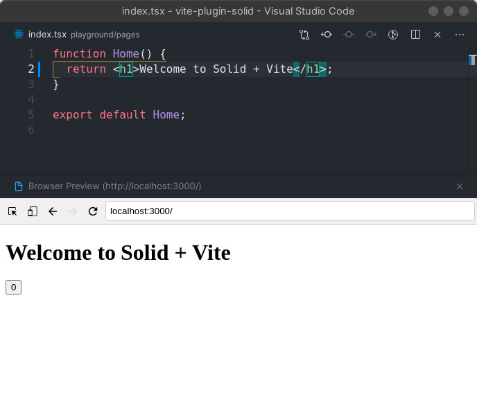

<p>
  
</p>

# ⚡ vite-plugin-solid

A simple integration to run [solid-js](https://github.com/solidjs/solid) with [vite](https://github.com/vitejs/vite)



# Got a question? / Need help?

Join [solid discord](https://discord.com/invite/solidjs) and check the [troubleshooting section](#troubleshooting) to see if your question hasn't been already answered.

## Features

- HMR with no configuration needed
- Drop-in installation as a vite plugin
- Minimal bundle size
- Support typescript (`.tsx`) out of the box
- Support code splitting out of the box

## Requirements

This module is 100% ESM compatible and requires NodeJS `14.18.0` or later.

You can check your current version of NodeJS by typing `node -v` in your terminal. If your version is below that one version I'd encourage you to either do an update globally or use a NodeJS version management tool such as [Volta](https://volta.sh/) or [nvm](https://github.com/nvm-sh/nvm).

Supported Vite versions: **Vite 6, 7 and 8**. Support for Vite 3–5 was
dropped; if you are on an older Vite, stay on an earlier release of this
plugin (2.x) or upgrade Vite.

## Quickstart

You can use the [vite-template-solid](https://github.com/solidjs/templates) starter templates similar to CRA:

```bash
$ npx degit solidjs/templates/js my-solid-project
$ cd my-solid-project
$ npm install # or pnpm install or yarn install
$ npm run start # starts dev-server with hot-module-reloading
$ npm run build # builds to /dist
```

## Installation

Install `vite`, `vite-plugin-solid` as dev dependencies.

Install `solid-js` as dependency.

You have to install those so that you are in control to which solid version is used to compile your code.

```bash
# with npm
$ npm install -D vite vite-plugin-solid
$ npm install solid-js

# with pnpm
$ pnpm add -D vite vite-plugin-solid
$ pnpm add solid-js

# with yarn
$ yarn add -D vite vite-plugin-solid
$ yarn add solid-js
```

Add it as plugin to `vite.config.js`

```js
// vite.config.ts
import { defineConfig } from 'vite';
import solidPlugin from 'vite-plugin-solid';

export default defineConfig({
  plugins: [solidPlugin()],
});
```

## Run

Just use regular `vite` or `vite build` commands

```json
{
  "scripts": {
    "dev": "vite",
    "build": "vite build"
  }
}
```

## API

### options

- Type: Object
- Default: {}

#### options.include

- Type: (string | RegExp)[] | string | RegExp | null
- Default: undefined

A [picomatch](https://github.com/micromatch/picomatch) pattern, or array of patterns, which specifies the files the plugin should operate on.

#### options.exclude

- Type: (string | RegExp)[] | string | RegExp | null
- Default: undefined

A [picomatch](https://github.com/micromatch/picomatch) pattern, or array of patterns, which specifies the files to be ignored by the plugin.

#### options.dev

- Type: Boolean
- Default: true

This will inject `solid-js/dev` in place of `solid-js` in dev mode. Has no effect in prod.
If set to false, it won't inject it in dev.
This is useful for extra logs and debug.

#### options.hot

- Type: Boolean
- Default: true

This will inject HMR runtime in dev mode. Has no effect in prod.
If set to false, it won't inject the runtime in dev.

#### options.ssr

- Type: Boolean | Object
- Default: false

`ssr: true` enables the SSR transforms (hydratable client code, SSR server
code); you provide the entries and the server yourself, as before.

The object form — even empty, `ssr: {}` — additionally turns on **turnkey
SSR**: a plain Vite app gets streaming server-side rendering with zero
wiring. No entry files, no `index.html`, no dev server script.

```ts
// vite.config.ts
import { defineConfig } from 'vite';
import solidPlugin from 'vite-plugin-solid';

export default defineConfig({
  plugins: [solidPlugin({ ssr: {} })],
});
```

```tsx
// src/App.tsx — the entire app: a plain content component
export default function App() {
  return <h1>Hello SSR</h1>;
}
```

- **Dev**: `vite` just works — a middleware on the dev server streams the
  rendered app for HTML-accepting GET requests through the SSR environment,
  injecting the Vite client (HMR, error overlay) and the dev style patch
  into `<head>`. SSR errors render Vite's error page with the overlay.
- **Build**: a plain `vite build` produces both bundles via the
  environments/builder API — client assets (+ manifest) to `dist/client` and
  the server bundle to `dist/server/server.js`. (`vite build --app`, or the
  classic `vite build` + `vite build --ssr` two-step, work too.)
- **Prod**: the server bundle's entry is `virtual:solid-ssr-handler`, whose
  `handleRequest(request)` export maps a web-standard `Request` to a
  streamed `Response` — adapter-agnostic, so any node server / worker /
  runtime mounts SSR in one line:

```js
import { handleRequest } from './dist/server/server.js';
// serve dist/client statically, everything else:
const response = await handleRequest(request);
```

Each request is scoped with `provideRequestEvent`, so `getRequestEvent()`
works during the render; hashed client assets (entry script, CSS) are
resolved through the build manifest and injected into `<head>`.

**Entry resolution** (all paths relative to the Vite root):

1. Explicit `ssr.entryServer` / `ssr.entryClient` options.
2. Conventional files: `src/entry-server.{tsx,jsx,ts,js,mjs}` and
   `src/entry-client.{tsx,jsx,ts,js,mjs}`. Entry files come in pairs —
   providing only one is an error. The server entry must export
   `render(request?, context?)` returning a `renderToStream` result, an HTML
   string, or a `Response`; `context.clientEntry` carries the resolved
   client entry URL, and in production any literal
   `"/src/entry-client.tsx"` reference in the rendered HTML is rewritten to
   the hashed asset (the classic harness convention keeps working).
3. Generated entries (the zero-config path): when no entry files exist, both
   are generated from a root component — `ssr.app`, defaulting to
   `src/App.{tsx,jsx,ts,js}` (or lowercase `src/app.*`) — wrapped in a
   document shell: `ssr.document`, defaulting to `src/Document.{tsx,jsx}`,
   else a built-in minimal shell. A custom document receives the app as
   `props.children` and must render the full `<html>` document including
   `<HydrationScript />`; the client entry script is injected into `<head>`
   automatically.

With [`serverFunctions`](#optionsserverfunctions) also enabled the two
compose: in dev the server-function middleware handles the endpoint before
SSR; in production the same `handleRequest` serves the endpoint too.

Turnkey serving is opt-in via the object form, so existing `ssr: true` setups
are unaffected. See `examples/ssr-turnkey` for a complete app (including a
one-file production server) and `examples/ssr` for the manual `ssr: true`
wiring.

#### options.serverFunctions

- Type: Boolean | Object
- Default: undefined

Enables `"use server"` server function compilation (experimental). Pass
`true` for the defaults (runtime from `@solidjs/web/server-functions`,
endpoint `/_server`) or an options object (`runtime`, `endpoint`, `filter`,
`directive`, `manifest`) to customize.

The setup is turnkey: in dev a middleware on the Vite server handles the
endpoint end to end — no server-function code needed in your server entry.
For production SSR builds, either use turnkey SSR (the object form of
[`ssr`](#optionsssr), whose handler serves the endpoint automatically) or
import `virtual:solid-server-function-handler` in your server entry and
mount its `handleServerFunctionRequest(request)` export on the endpoint.

Meta-frameworks that need to control plugin ordering and dispatch requests
through their own server should use the standalone `serverFunctions()`
export instead, which never installs the dev middleware. See
`examples/server-functions` for a complete app.

#### options.compiler

- Type: `"babel" | "native"`
- Default: `"native"`

Choose the JSX compiler backend. The default `"native"` compiles JSX through
the native compiler from `@dom-expressions/compiler`. `"babel"` runs
`babel-preset-solid` instead and only switches the JSX transform — every
other pass (the `lazy()` module-URL transform and the solid-refresh HMR
transform) is native in both modes.

`"babel"` is the escape hatch: if the native output ever differs from what
you expect, set `compiler: 'babel'` and file an issue — the behavioral diff
between the two modes is the bug report. Platforms without a prebuilt native
binary (for example StackBlitz WebContainers) automatically fall back to the
`@dom-expressions/compiler-wasm32-wasi` build, so no configuration is needed
there.

```ts
import { defineConfig } from 'vite';
import solidPlugin from 'vite-plugin-solid';

export default defineConfig({
  plugins: [solidPlugin({ compiler: 'babel' })],
});
```

#### options.babel

- Type: Babel.TransformOptions
- Default: {}

Pass any additional [babel transform options](https://babeljs.io/docs/en/options). Those will be merged with the transformations required by Solid.

#### options.solid

- Type: [@dom-expressions/compiler](https://github.com/ryansolid/dom-expressions/tree/main/packages/compiler#options) / [@dom-expressions/babel-plugin-jsx](https://github.com/ryansolid/dom-expressions/tree/main/packages/babel-plugin-jsx#plugin-options)
- Default: {}

Pass additional DOM Expressions JSX compiler options. They will be merged with
Solid's defaults (`moduleName: "@solidjs/web"`, Solid built-ins, custom-element
context, and conditional wrapping) and applied to whichever compiler backend is
selected.

#### options.typescript

- Type: [@babel/preset-typescript](https://babeljs.io/docs/en/babel-preset-typescript)
- Default: {}

Pass any additional [@babel/preset-typescript](https://babeljs.io/docs/en/babel-preset-typescript).

#### options.extensions

- Type: (string, [string, { typescript: boolean }])[]
- Default: []

An array of custom extension that will be passed through the solid compiler.
By default, the plugin only transform `jsx` and `tsx` files.
This is useful if you want to transform `mdx` files for example.

## Note on HMR

Starting from version `1.1.0`, this plugin handles automatic HMR. The refresh
transform is compiled natively by `@dom-expressions/compiler` and drives the
dev-only `solid-js/refresh` runtime entry that ships with Solid (the
standalone [solid-refresh](https://github.com/solidjs/solid-refresh) package
is no longer used).

At this stage it's still early work but provide basic HMR. In order to get the best out of it there are couple of things to keep in mind:

- When you modify a file every state below this component will be reset to default state (including the current file). The state in parent component is preserved.

- The entrypoint can't benefit from HMR yet and will force a hard reload of the entire app. This is still really fast thanks to browser caching.

If at least one of this point is blocking to you, you can revert to the old behavior by [opting out the automatic HMR](#options) and placing the following snippet in your entry point:

```jsx
const dispose = render(() => <App />, document.body);

if (import.meta.hot) {
  import.meta.hot.accept();
  import.meta.hot.dispose(dispose);
}
```

# Troubleshooting

- It appears that Webstorm generate some weird triggers when saving a file. In order to prevent that you can follow [this thread](https://intellij-support.jetbrains.com/hc/en-us/community/posts/360000154544-I-m-having-a-huge-problem-with-Webstorm-and-react-hot-loader-) and disable the **"Safe Write"** option in **"Settings | Appearance & Behavior | System Settings"**.

- If one of your dependency spit out React code instead of Solid that means that they don't expose JSX properly. To get around it, you might want to manually exclude it from the [dependencies optimization](https://vitejs.dev/config/dep-optimization-options.html#optimizedeps-exclude)

- If you are trying to make [directives](https://www.solidjs.com/docs/latest/api#use%3A___) work, and they somehow don't try setting the `options.typescript.onlyRemoveTypeImports` option to `true`

## Migration from v1

The master branch now target vite 2.

The main breaking change from previous version is that the package has been renamed from `@amoutonbrady/vite-plugin-solid` to `vite-plugin-solid`.

For other breaking changes, check [the migration guide of vite](https://vitejs.dev/guide/migration.html).

# Testing

If you are using [vitest](https://vitest.dev/), this plugin already injects the necessary configuration for you. It even automatically detects if you have `@testing-library/jest-dom` installed in your project and automatically adds it to the `setupFiles`. All you need to add (if you want) is `globals`, `coverage`, and other testing configuration of your choice. If you can live without those, enjoy using vitest without the need to configure it yourself.

# Credits

- [solid-js](https://github.com/solidjs/solid)
- [vite](https://github.com/vitejs/vite)
