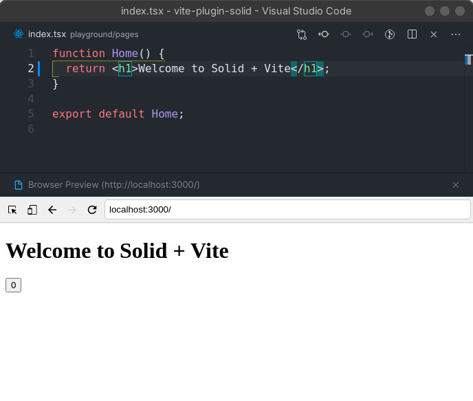

<p>
  
</p>

# ⚡ @solidjs/vite-plugin

> **Renamed from `vite-plugin-solid`.** This package was previously published as
> [`vite-plugin-solid`](https://www.npmjs.com/package/vite-plugin-solid). To migrate,
> swap the dependency and the import — `npm install -D @solidjs/vite-plugin` and
> `import solid from '@solidjs/vite-plugin'` — nothing else changes.

A simple integration to run [solid-js](https://github.com/solidjs/solid) with [vite](https://github.com/vitejs/vite)



# Got a question? / Need help?

Join [solid discord](https://discord.com/invite/solidjs) and check the [troubleshooting section](#troubleshooting) to see if your question hasn't been already answered.

## Features

- HMR with no configuration needed
- Drop-in installation as a vite plugin
- Minimal bundle size
- Support typescript (`.tsx`) out of the box
- Experimental TypeScript TSRX (`.tsrx`) support out of the box
- Support code splitting out of the box

## Requirements

This module is 100% ESM compatible and requires Node.js `^20.19.0 || >=22.12.0`.

You can check your current Node.js version by running `node -v`. Use a version
manager such as [Volta](https://volta.sh/) or [nvm](https://github.com/nvm-sh/nvm)
to update it.

Supported Vite versions: **Vite 8 and 9**.

## Quickstart

You can use the [vite-template-solid](https://github.com/solidjs/templates) starter templates similar to CRA:

```bash
$ npx degit solidjs/templates/js my-solid-project
$ cd my-solid-project
$ npm install # or pnpm install or yarn install
$ npm run start # starts dev-server with hot-module-reloading
$ npm run build # builds to /dist
```

## Installation

Install `vite`, `@solidjs/vite-plugin` as dev dependencies.

Install `solid-js` as dependency.

You have to install those so that you are in control to which solid version is used to compile your code.

```bash
# with npm
$ npm install -D vite @solidjs/vite-plugin
$ npm install solid-js

# with pnpm
$ pnpm add -D vite @solidjs/vite-plugin
$ pnpm add solid-js

# with yarn
$ yarn add -D vite @solidjs/vite-plugin
$ yarn add solid-js
```

Add it as plugin to `vite.config.js`

```js
// vite.config.ts
import { defineConfig } from 'vite';
import solidPlugin from '@solidjs/vite-plugin';

export default defineConfig({
  plugins: [solidPlugin()],
});
```

## Run

Just use regular `vite` or `vite build` commands

```json
{
  "scripts": {
    "dev": "vite",
    "build": "vite build"
  }
}
```

## API

### options

- Type: Object
- Default: {}

#### options.include

- Type: (string | RegExp)[] | string | RegExp | null
- Default: undefined

A [picomatch](https://github.com/micromatch/picomatch) pattern, or array of patterns, which specifies the files the plugin should operate on.

#### options.exclude

- Type: (string | RegExp)[] | string | RegExp | null
- Default: undefined

A [picomatch](https://github.com/micromatch/picomatch) pattern, or array of patterns, which specifies the files to be ignored by the plugin.

#### options.dev

- Type: Boolean
- Default: true

This will inject `solid-js/dev` in place of `solid-js` in dev mode. Has no effect in prod.
If set to false, it won't inject it in dev.
This is useful for extra logs and debug.

#### options.observe

- Type: Boolean
- Default: false

Resolve Solid's observe builds in production: the production-speed runtime that keeps the
diagnostics and attribution channels (`OBSERVE`) alive for observability tooling (error
monitoring, performance tracing). Adds the `observe` export condition to every environment
and turns on the compiler's `componentNames` option, so component owner labels (`<Home>`)
survive minification. Under `vite dev` the dev build still wins.

#### options.hot

- Type: Boolean
- Default: true

This will inject HMR runtime in dev mode. Has no effect in prod.
If set to false, it won't inject the runtime in dev.

#### options.ssr

- Type: Boolean
- Default: false

Whether the app is server-rendered — one meaning everywhere.

Without [`start`](#optionsstart), `ssr: true` enables the SSR transforms
(hydratable client code, SSR server code); you provide the entries and the
server yourself, as before. With `start`, the boolean selects the start
mode: `ssr: true` is SSR start mode, `ssr: false`/omitted is client start
mode — see below.

Objects are no longer accepted (config-time error): the start-mode options
that used to live on `ssr: { ... }` moved to `start: { ... }`, with
`ssr: true` set alongside.

#### options.start

- Type: Boolean | Object
- Default: undefined

**Start is now a mode of the plugin**: the serving layer that
replaces SolidStart. The plugin owns entries, dev serving, and the build —
no entry files, no `index.html`, no dev server script. `start: true` is the
zero-config spelling; add `ssr: true` for streaming SSR:

```ts
// vite.config.ts
import { defineConfig } from 'vite';
import solidPlugin from '@solidjs/vite-plugin';

export default defineConfig({
  plugins: [solidPlugin({ start: true, ssr: true })],
});
```

One set of conventions serves both rendering modes, and the
[`ssr`](#optionsssr) boolean picks between them: `ssr: true` streams
server-side rendering with zero wiring; without it the same app is
client-rendered onto a prerendered static shell. Flipping a project between
SPA and SSR is toggling that one boolean — same `App`, same `Document`,
same server functions.

The object form carries the options (`start: true` is pure sugar for
`start: {}` — both mean the identical start mode with defaults, and
`false`/absent means off): `app`, `document`, `entryServer`, `entryClient`,
`middleware`, `setup`, `renderMode`, `env`, `devtools`, `errorBoundary`,
`css`, `external`, all documented below.

Install `@solidjs/start-devtools` as a development dependency to add the
development toolbar with runtime errors and server function calls:

```sh
pnpm add -D @solidjs/start-devtools@next
```

Start mode detects the package automatically. Set `start: { devtools: true }`
to require it or `start: { devtools: false }` to disable automatic integration.
The package is an optional peer and the toolbar is not included in production
builds.

Generated entries wrap the app automatically. With custom server and client
entries, place the development boundary around the app in the shared document
or root:

```tsx
import { DevToolbar } from "@solidjs/start-devtools";

<body>
  <DevToolbar>
    <App />
  </DevToolbar>
</body>;
```

The package becomes a children-only passthrough in production, so no toolbar
code is included in either production bundle.

```tsx
// src/App.tsx — the entire app: a plain content component
export default function App() {
  return <h1>Hello SSR</h1>;
}
```

With `ssr: true` — **SSR start mode**:

- **Dev**: `vite` just works — a middleware on the dev server streams the
  rendered app for HTML-accepting GET requests through the SSR environment,
  injecting the Vite client (HMR, error overlay) and the dev style patch
  into `<head>`. SSR errors render Vite's error page with the overlay.
- **Build**: a plain `vite build` produces both bundles via the
  environments/builder API — client assets (+ manifest) to `dist/client` and
  the server bundle to `dist/server/server.js`. (`vite build --app`, or the
  classic `vite build` + `vite build --ssr` two-step, work too.)
- **Build ordering**: server builds read the client manifest, so with `ssr`
  enabled the plugin also orders builder-mode (environments API) app builds
  client-first via a `buildApp` hook. That covers composed
  setups whose own orchestrator builds server environments before the
  client — e.g. @cloudflare/vite-plugin — with no hand-written ordering
  plugin; setups without another orchestrator keep Vite's stock
  build-everything behavior, just client-first.
- **Prod**: the server bundle's entry is `virtual:solid-ssr-handler`.
  Its named `handleRequest(request)` export maps a web-standard `Request`
  to a streamed `Response`; its default `{ fetch(request) }` export provides
  the same handler in the Fetchable shape used by Workers, Nitro, Netlify
  Functions, Bun, and `deno serve`:

```js
import app, { handleRequest } from './dist/server/server.js';
// serve dist/client statically, everything else:
const response = await handleRequest(request);
const sameResponse = await app.fetch(request);
```

The Fetchable wrapper deliberately accepts only the request. Hosts may pass
environment or execution-context arguments after it; those are not the
Solid options accepted by `handleRequest`'s second parameter.

Among those options, **`event`** is the supported public seam for extending
the request event: its fields spread into the event at creation, so a custom
server entry (or a host wrapper) can attach whatever its platform knows and
read it back anywhere in the request scope with `getRequestEvent()`. The
conventional field name is `nativeEvent` — the platform's raw request
object. A Node entry passes the `IncomingMessage`:

```js
import { createServer } from 'node:http';
import { handleRequest } from './dist/server/server.js';

createServer(async (req, res) => {
  const response = await handleRequest(webRequest(req), {
    event: { nativeEvent: req },
  });
  // ... write response to res
});
```

```js
// anywhere inside the request scope (middleware, setup, app code)
import { getRequestEvent } from '@solidjs/web';
const event = getRequestEvent();
event.nativeEvent; // the Node IncomingMessage the entry passed
```

The plugin's own dev and preview middlewares (and the server-function dev
middleware) pass `event: { nativeEvent: req }` with the Node request, so
`getRequestEvent().nativeEvent` answers the same under `vite dev` and
`vite preview` as behind a Node entry written like the above. For the
client's IP on bare Node, read `event.nativeEvent.socket.remoteAddress`;
behind a proxy or load balancer that address is the proxy's, so read the
forwarding headers off `event.request` instead (`x-forwarded-for` and
friends) — only when you trust the proxy that set them.

- **Preview**: `vite build && vite preview` runs the production artifact
  with no server file — Vite's preview statics serve `dist/client`, and
  everything else (pages, the server-function endpoint, middleware)
  dispatches through the built handler.

Each request is scoped with `provideRequestEvent`, so `getRequestEvent()`
works during the render; hashed client assets (entry script, CSS) are
resolved through the build manifest and injected into `<head>`.

Every dispatch runs under a stub-backed request event
(`createRequestEvent` from `@solidjs/web`), and page responses go through
the runtime's response-head lifecycle (`createSSRResponse`):
`httpStatus()` / `httpHeader()` writes made during the render land on the
wire at shell flush, a `Location` header set before the flush becomes a
real 3xx redirect, and one set after it (streamed responses) falls back to
a `<script>window.location=...</script>` tail.

**`middleware`** points at a server-only module default-exporting one
fetch-style middleware — `(request, next) => Response | Promise<Response>`
— or an array of them, composed in order:

```ts
// vite.config.ts
solid({ start: { middleware: './src/middleware.ts' }, ssr: true });

// src/middleware.ts
import { getRequestEvent } from '@solidjs/web';

export default async function auth(request: Request, next) {
  getRequestEvent().locals.user = await userFromCookie(request);
  try {
    const response = await next();
    response.headers.set('server-timing', 'app'); // pre-wire window
    return response;
  } catch (error) {
    return new Response('oops', { status: 500 });
  }
}
```

The chain fronts every request the plugin dispatches — page SSR and the
server-function endpoint, dev, production, and preview alike — and runs
inside the request-event scope, so `getRequestEvent()` works exactly as in
application code (the endpoint shares the chain's event, so `locals`
decoration is visible to server functions too). Nothing reaches the wire
until the outermost middleware returns: headers stay mutable after
`next()` even for streamed responses.

**`setup`** points at a server-only module default-exporting a per-request
app-setup hook: `(event, App) => Component | void | Promise<Component |
void>`. The generated server entry awaits it after the middleware chain has
dispatched to the page render and immediately before `renderToStream` — the
seam for routers that must prepare an app instance per request before SSR
can begin (create a router bound to the request, `await router.load()`,
then render):

```ts
// vite.config.ts
solid({ start: { setup: './src/setup.tsx' }, ssr: true });

// src/setup.tsx
import type { Component } from 'solid-js';
import type { RequestEvent } from '@solidjs/web';

export default async function setup(event: RequestEvent, App: Component) {
  const router = createRouter({ url: event.request.url });
  await router.load(); // async work completes before the shell streams
  return () => <App router={router} />; // rendered in the app's place
}
```

`event` is the shared request event — the same one the middleware chain
decorated, so `locals` are visible — and the hook runs inside the request
scope (`getRequestEvent()` answers in anything it calls). Return a
component and the generated entry renders it inside the Document where
`<App />` would have been; return nothing and `<App />` renders unchanged,
so a pure side-effect setup (seeding a per-request cache) needs no return.
Zero-config apps are untouched: without the option the generated entry is
byte-identical to before.

Two boundaries to know: the hook is a page-render seam — the middleware
chain and the server-function endpoint run without it — and it only exists
in generated entries (an authored `entry-server` owns `render()` already;
configuring both is an error). And as with any server-side tree shaping,
whatever the hook renders must be matched client-side for hydration —
routers that own both sides (their client entry re-creates the router and
hydrates the same tree) fit naturally.

**`renderMode`** — how a page render becomes a response body: `'stream'`
(the default) or `'async'`, or a module path deciding per request.

Streaming flushes the document shell as soon as it is ready, with every
`<Loading>` fallback in place, and streams the boundaries' content behind it
in later chunks; inline scripts swap that content into the page as it
arrives. That is the best time-to-first-byte a server render can have, but a
client that never runs JavaScript — a crawler, `curl`, a browser with
scripts disabled — is left looking at the fallbacks forever
([solidjs/solid#3280](https://github.com/solidjs/solid/issues/3280)).
`'async'` is the other end of that trade: the handler awaits the render until
every boundary has settled and sends one complete document.

```ts
solid({ start: { renderMode: 'async' }, ssr: true });
```

Because nothing has flushed when a boundary resolves, its content is spliced
in place of its placeholder — the document carries no fallback markup, no
swap templates, no swap scripts — while hydration data still serializes
exactly as before, so JavaScript clients hydrate the settled document the
same way they hydrate a streamed one. The tradeoffs are inherent: the
response waits for the slowest boundary before its first byte, and the whole
page buffers in memory before it goes out. Two consequences worth knowing:
`deferStream` is moot under `'async'` (everything defers), and a `Location`
header written mid-render — the post-flush script redirect in stream mode —
becomes a real 3xx with no body, which is exactly what a no-JS client needs.

Most apps want streaming for browsers and a complete document for the few
clients that cannot run the swap. The per-request form is a module path
(relative to the Vite root, following the `middleware`/`setup` convention
— a Vite config cannot serialize a closure into the generated handler)
default-exporting `(event) => 'stream' | 'async' | Promise<'stream' |
'async'>`. It runs inside the request scope after the middleware chain, so
`event.locals` is decorated by the time it decides:

```ts
// vite.config.ts
solid({ start: { renderMode: './src/render-mode.ts' }, ssr: true });

// src/render-mode.ts
import type { RequestEvent } from '@solidjs/web';

const CRAWLER = /Googlebot|bingbot|DuckDuckBot|Slurp|Baiduspider|YandexBot/i;

export default function renderMode(event: RequestEvent) {
  const { request } = event;
  if (new URL(request.url).searchParams.has('nojs')) return 'async';
  if (CRAWLER.test(request.headers.get('user-agent') ?? '')) return 'async';
  return 'stream';
}
```

Hosts driving the handler directly can decide per call instead:
`handleRequest(request, { renderMode: 'async' })`. Precedence is that
runtime option, then the module function's result, then the static config;
an unknown value from any of the three is an error naming its source. The
mode applies to generated and authored entries alike — an authored
`render()` returning a `renderToStream` result is awaited the same way (and
in production its client-entry reference is still rewritten). `httpStatus()` /
`httpHeader()` declarations survive either mode: the runtime freezes the
response head when the awaited render completes (`@solidjs/web` 2.0.0-rc.7+),
just as streaming freezes it at shell flush. Server mode only — in client mode the served shell has no boundaries to
settle, so the option is a documented no-op there.

**`env`** — first-party typed environment variables. A schema file at the
project root — `env.ts` (or `env.js`), probed automatically; point
elsewhere with `start: { env: './path' }`, disable with `env: false` —
default-exports `server` and `client` maps of
[Standard Schema](https://standardschema.dev) validators (zod, valibot,
arktype — even mixed per key; nothing is imported from the plugin):

```ts
// env.ts
import { z } from 'zod';

export default {
  server: {
    DATABASE_URL: z.url(),
    SESSION_SECRET: z.string().min(32),
  },
  client: {
    VITE_APP_NAME: z.string().min(1),
  },
};
```

The validated values come back through two fully typed virtual modules:

```ts
// server-only modules (middleware, "use server" modules, the server entry)
import { env } from 'virtual:env/server'; // every var

// anywhere
import { env } from 'virtual:env/client'; // the VITE_-prefixed client vars
```

- **Validation is node-only and layered.** The plugin loads the `.env*`
  files through Vite's `loadEnv` (with `process.env` winning, so CI
  secrets take precedence), folds them into `process.env` itself — no
  `loadEnv` one-liner in vite.config, and server code reading
  `process.env` directly sees the file-loaded vars too — and validates
  before anything builds. In dev every failure renders the error overlay
  with the per-key report, and `.env*`/schema edits revalidate live. In a
  build, `client` failures fail the build (those values are baked);
  `server` failures only warn — a build machine may legitimately not have
  the production secrets — and boot validation enforces them.
- **Client values are baked, server values are runtime.** That's what the
  public `VITE_` prefix means: `virtual:env/client` is the validated
  output serialized as plain JSON (defaults applied, coercions done) with
  zero schema-library bytes. `virtual:env/server` is not baked — it reads
  `process.env` when the server boots and validates through your own
  schema (imported into the server bundle, where shipping the validator
  is fine). Platform-injected vars that don't exist at build time work,
  secrets rotate without a rebuild, and no secret value exists in any
  dist artifact; an invalid server environment fails boot with the same
  per-key report. Boot validation is synchronous: the generated server
  env module contains no top-level await, so the server bundle works
  under any downstream build target (Nitro's node-server preset,
  es2020 — no `esnext` override needed). The flip side: `server`
  validators must be synchronous — an async refinement/transform on a
  server key is rejected at config time with the fix in the message
  (`client` keys may stay async; they are awaited at build time where
  the values are baked).
- **Leaks are errors.** Importing `virtual:env/server` from a client
  module graph is a hard error naming the importer (the app root and
  everything it imports hydrate — they are client code; keep server env
  in middleware, `"use server"` modules, or an authored server entry).
  Client keys must carry the public prefix (`VITE_`, or your `envPrefix`)
  — enforced at config time. And a client-build scan fails the build when
  a server var's literal value shows up quoted in a client chunk.
- **Types are generated by inference.** A `solid-env.d.ts` is written next
  to the schema file (keep both inside your tsconfig `include`): it
  derives each var's type from your own schema through the Standard
  Schema output type, so `env.VITE_APP_NAME` is whatever your validator
  outputs — with any compliant library and no per-library plumbing.

Env works identically in both `start` modes (a client-mode static build
carries only the client vars); it is a start-mode feature, so without `start`
there is no env layer. See `examples/start-env` for the full story,
including the failure modes.

Design credit: the shape of this feature — the schema-file convention,
the `virtual:env/*` module names (kept identical on purpose), baked
client values, the leak scan — follows
[@vite-env/core](https://github.com/pyyupsk/vite-env) (MIT), the
design-correct prior art, reimplemented on this plugin's machinery with
Standard Schema as the only contract (and runtime-read server values).

**`errorBoundary`** — in a production build, generated entries wrap the app
in a default error boundary (and the document in an outer one): a render
error streams a generic `500 | Internal Server Error` fallback — no stack
or error details reach the HTML; the error itself goes to `console.error`
— and an error caught before the shell flushes commits a real 500 status
through the response-head lifecycle. Development is unaffected (Vite's
error overlay owns dev errors), as are authored entries — the boundary is
generated-entry codegen. Disable it with `start: { errorBoundary: false }`
when application middleware owns error handling (an error middleware only
sees the throw when no boundary catches it first). Default: `true`.

**`css.filter`** — include/exclude patterns
([picomatch](https://github.com/micromatch/picomatch) globs or regexes;
relative globs resolve against the Vite root) for the module graphs the dev
server crawls when collecting the CSS it inlines into `<head>` (the no-FOUC
guarantee). By default the crawl covers the app's own sources and skips
`node_modules`. `exclude` prunes matching graphs — providing one replaces
the default `node_modules` exclusion — and `include` opts matching files in
on top of that baseline, which is how a dependency's CSS gets
server-inlined in dev:

```ts
solid({
  start: {
    css: { filter: { include: /node_modules\/some-ui-lib/ } },
  },
  ssr: true,
});
```

CSS files themselves and virtual modules always pass — the filter decides
which module graphs are traversed, not which stylesheets are kept — and a
file matching both patterns stays excluded (Vite `createFilter`'s
conflict rule). Development only: excluding a graph does not remove its
CSS from the production build, where CSS always comes from the built
assets.

**Entry resolution** (all paths relative to the Vite root):

1. Explicit `start.entryServer` / `start.entryClient` options.
2. Conventional files: `src/entry-server.{tsx,jsx,ts,js,mjs,tsrx}` and
   `src/entry-client.{tsx,jsx,ts,js,mjs,tsrx}`. Entry files come in pairs —
   providing only one is an error. The server entry must export
   `render(request?, context?)` returning a `renderToStream` result, an HTML
   string, or a `Response`; `context.clientEntry` carries the resolved
   client entry URL, and in production any literal
   `"/src/entry-client.tsx"` reference in the rendered HTML is rewritten to
   the hashed asset (the classic harness convention keeps working).
3. Generated entries (the zero-config path): when no entry files exist, both
   are generated from a root component — `start.app`, defaulting to
   `src/App.{tsx,jsx,ts,js,tsrx}` (or lowercase `src/app.*`) — wrapped in a
   document shell: `start.document`, defaulting to `src/Document.{tsx,jsx,tsrx}`,
   else a built-in minimal shell. A custom document receives the app as
   `props.children` and must render the full `<html>` document including
   `<HydrationScript />`; the client entry script is injected into `<head>`
   automatically.

With [`serverFunctions`](#optionsserverfunctions) also enabled the two
compose: `handleRequest` serves the endpoint on every surface (in dev the
server-function middleware pre-loads the referenced module, then dispatches
through the same handler), so one middleware chain and one request event
front pages and server functions identically.

The normal `ssr` environment exposes the default Fetchable handler as its
`index` service entry in development and production. Provider Vite plugins
can adopt that environment directly: they supply its runtime and build
orchestration while Solid continues to supply the application entry,
manifest, middleware, and server-function dispatch. When a provider replaces
the development environment with a non-runnable one, Solid detects that
ownership and stands its HTTP middlewares down automatically.

Two explicit switches remain for custom host setups:

1. **`start.external: true`** — hands the whole server side to a host that
   does not adopt Solid's normal `ssr` environment. Solid skips its
   server-build wiring and stands its development middlewares down, while
   continuing to provide the generated entries, client manifest, and
   `virtual:solid-ssr-handler`. This is mainly for differently named or
   independently configured environments.
2. **[`serverFunctions.devMiddleware: false`](#optionsserverfunctions)** —
   the narrow, endpoint-only switch: keeps start mode's server build and SSR
   serving, hands only server-function dispatch in dev to the host. For
   setups without `start`, or when only the endpoint should move.

**`virtual:solid-manifest`** exposes the client asset manifest that serving
works from — a server-side module, available in dev and in SSR builds. In
an SSR build its default export is the parsed client manifest
(`dist/client/.vite/manifest.json`), keyed by source path with the resolved
Vite `base` attached as `_base`; in dev it exports the live asset resolver
the plugin uses for dev CSS collection instead of a static object. This is
the seam for frameworks and routers that do their own asset gating —
deciding which scripts and styles a response carries, as the TanStack Start
integration does — without re-reading the manifest from disk or re-deriving
`base`. Ambient types ship with the plugin
(`/// <reference types="@solidjs/vite-plugin/virtual-solid-manifest" />`);
see that `.d.ts` and the exported `ViteManifest` type for the full shape.

Without `ssr: true` — **client mode** (experimental), the same conventions
with client-only rendering:

```js
export default defineConfig({
  plugins: [solidPlugin({ start: true })],
});
```

- **Dev**: every HTML-accepting GET streams the rendered document shell —
  without the app, which never renders on the server — with the entry
  graph's CSS inlined; deep links get the same shell (history-fallback
  semantics). The generated client entry `render()`s (not hydrates) the app
  into `document.body`.
- **Build**: `vite build` emits a purely static `dist/client` — the shell is
  prerendered once through the built handler into `dist/client/index.html`,
  with the hashed entry script and the entry graph's CSS links — deployable
  to any static host. No server bundle remains unless `serverFunctions` is
  enabled, in which case `dist/server` is kept and its `handleRequest`
  serves the endpoint (pages stay static).
- **Transforms**: client code compiles exactly like a plain SPA today
  (`generate: 'dom'`, non-hydratable); only the document shell goes through
  the SSR transforms.
- **`vite preview`** serves the static build with history fallback (and
  dispatches the server-function endpoint through the kept handler).
- Server-only options are inert here rather than errors, so a config
  survives the flip untouched: `start.entryServer` (and conventional
  `src/entry-server.*` files) are ignored — the shell render is always
  generated — and so is `start.external`. An authored `src/entry-client.*`
  stands alone and owns the mount.

The point is the migration story: an app born with `start: true` moves to
server rendering by setting `ssr: true` — same `App`, same `Document`,
same routes, same server functions; the plugin swaps render for hydrate,
turns the hydratable transforms on, and ships the server bundle. (A
`Document` authored for SSR carries `<HydrationScript />`; in client mode
the plugin strips its script from the served shell — nothing hydrates, so
a shared `Document` costs nothing — and the built-in shell omits it.)

Start-mode serving is opt-in via `start`, so bare `ssr: true` setups keep the
transform-only behavior. See `examples/start-ssr` for a complete SSR app
(including a one-file production server and server functions),
`examples/start-client` for client mode (whose test flips the same app
between the modes), and `examples/ssr` for the manual `ssr: true` wiring.

#### options.serverFunctions

- Type: Boolean | Object
- Default: undefined

Enables `"use server"` server function compilation (experimental). Pass
`true` for the defaults (runtime from `@solidjs/web/server-functions`,
endpoint `/_server`) or an options object (`runtime`, `endpoint`, `filter`,
`directive`, `manifest`, `devMiddleware`, `configure`) to customize.

The setup is zero-config: in dev a middleware on the Vite server handles the
endpoint end to end — no server-function code needed in your server entry.
For production SSR builds, either use SSR start mode ([`start`](#optionsstart)
with `ssr: true`, whose handler serves the endpoint automatically) or
import `virtual:solid-server-function-handler` in your server entry and
mount its `handleServerFunctionRequest(request)` export on the endpoint.

**`devMiddleware: false`** hands endpoint dispatch in dev to a host instead
of the plugin's middleware. The middleware executes functions in Vite's
node-side SSR environment; when another plugin's server environment should
run them — e.g. @cloudflare/vite-plugin, so functions see workerd bindings
(`env`/`ctx`) in dev exactly like production — turn it off and let the host
dispatch: it loads `virtual:solid-server-function-handler` through its own
environment and calls `handleServerFunctionRequest(request)`, the same
contract as production. Compilation and the virtual modules keep working;
endpoint requests simply fall through to the host. Since the middleware's
on-demand module loading is off too, a host owning dev dispatch should
side-effect import `virtual:solid-server-function-manifest` in its server
entry so functions referenced only by client code still register. (When a
provider owns the `ssr` environment outright — it isn't runnable — the
middleware already stands down automatically; see the `external` option
under [`start`](#optionsstart) for the whole-server switch and how the
three options relate.)

**`configure: './src/server-config.ts'`** pins a server-only module (path
resolved against the Vite root) into the handler graph: the generated
`virtual:solid-server-function-handler` module side-effect imports it before
dispatching anything. It's the guaranteed pre-dispatch home for server-side
runtime registration — e.g. a router's single-flight collector:

```ts
// src/server-config.ts
import { configureServerFunctionsServer } from '@solidjs/web/server-functions/server';
configureServerFunctionsServer({ collectFlightData: createFlightDataCollector(router) });
```

Registration living in the app graph only loads with the first page render,
so after a dev-server restart the first mutation can race it; the handler
graph loads before the first dispatch on every surface (dev middleware and
production handler alike), and edits to the module hot-invalidate the
handler in dev. Config calls merge per key, so it composes with the
plugin's own runtime configuration.

Server-function requests are same-origin protected by `@solidjs/web`. To
allow another trusted origin, configure it in the same server-only module:

```ts
import { configureServerFunctionsServer } from '@solidjs/web/server-functions/server';

configureServerFunctionsServer({
  csrf: { origin: ['https://app.example.com'] },
});
```

Set `csrf: false` only when another trusted layer protects the endpoint.

Meta-frameworks that need to control plugin ordering and dispatch requests
through their own server should use the standalone `serverFunctions()`
export instead, which never installs the dev middleware. See
`examples/start-ssr` for a complete app.

**Server components (experimental):** `serverFunctions: { components: true }`
lets a `"use server"` function return a component. Server components ride
server functions — same endpoint, same compilation — with zero extra plugin
config: responses for component-returning functions are served as streamed
HTML that the client applies in place (client state and DOM identity inside
survive updates), and the plugin's dev middleware and production handler
handle that automatically. Combined with SSR start mode
([`start`](#optionsstart) with `ssr: true`) and generated entries, the
document wiring is emitted too: server components render inline in the
SSR'd document and are adopted
at boot with zero endpoint requests. With authored entries, the app-side
pieces (the render plugin and the client's `installServerComponents()`
call, both from `@solidjs/web/frames`) live in your entry files instead.
See `examples/start-ssr` for a complete page.

Composing hosts (e.g. the Astro adapter or TanStack Start's Solid
integration) that emit that document wiring themselves — the render plugin
around their renders plus a client-side `installServerComponents()` call —
should set `components: 'external'` instead of `true`. It behaves
identically (all the same transforms and codegen), and declares the host
owns the wiring, so the plugin skips the warning it otherwise prints when
the option is enabled without SSR start mode. It reuses the plugin's
`external` vocabulary (cf. `start.external` — a host owns the server).

#### options.compiler

- Type: `"babel" | "native"`
- Default: `"native"`

Choose the JSX compiler backend. The default `"native"` compiles JSX through
the native compiler from `@solidjs/compiler`. `"babel"` runs
`@solidjs/babel-plugin` instead and only switches the JSX transform — every
other pass (the `lazy()` module-URL transform and the solid-refresh HMR
transform) is native in both modes.

`"babel"` is the escape hatch: if the native output ever differs from what
you expect, set `compiler: 'babel'` and file an issue — the behavioral diff
between the two modes is the bug report. Platforms without a prebuilt native
binary (for example StackBlitz WebContainers) automatically fall back to the
`@solidjs/compiler-wasm32-wasi` build, so no configuration is needed
there.

```ts
import { defineConfig } from 'vite';
import solidPlugin from '@solidjs/vite-plugin';

export default defineConfig({
  plugins: [solidPlugin({ compiler: 'babel' })],
});
```

#### Experimental TSRX

Files ending in `.tsrx` are recognized automatically as TypeScript TSRX; they
do not need to be listed in `options.extensions`. Both the native and Babel
compiler backends preserve the `.tsrx` filename when invoking their TSRX
frontends.

Scoped CSS emitted by either backend is exposed as a sibling virtual CSS
sidecar and imported once from the compiled module. The sidecar goes through
Vite's normal CSS pipeline, so extraction and injection work in development,
production builds, and SSR, including client HMR and SSR development style
collection. A file that emits no CSS has no sidecar import.

The Babel backend chains TSRX source maps through the later lazy-module and
refresh transforms. The native compiler does not currently emit the required
TSRX projection map, so native `.tsrx` transforms return no source map. With
`compiler: "native"` and custom `babel` options, the custom Babel support pass
runs after native TSRX lowering (on ordinary JavaScript); ordinary JSX/TSX
keeps the existing pre-native ordering.

With `serverFunctions` enabled, function-level `"use server"` directives work
in `.tsrx` with both compiler backends. The plugin lowers TSRX first, then runs
the same native directive transform while retaining the authored `.tsrx` path
for stable client/server function IDs. TSRX's host-defined
`module server { ... }` profile is not supported.

#### options.babel

- Type: Babel.TransformOptions
- Default: {}

Pass any additional [babel transform options](https://babeljs.io/docs/en/options). Those will be merged with the transformations required by Solid.
With the native compiler these options normally run before JSX lowering; for
`.tsrx` only, they run after native TSRX lowering as described above.

#### options.solid

- Type: [@solidjs/compiler](https://github.com/solidjs/solid/tree/main/packages/compiler) / [@solidjs/babel-plugin](https://github.com/solidjs/solid/tree/main/packages/babel-plugin)
- Default: {}

Pass additional Solid JSX compiler options. Both backends carry the Solid
defaults (`moduleName: "@solidjs/web"`, the control-flow built-ins,
custom-element context, and conditional wrapping) internally; anything set
here is merged over them and applied to whichever backend is selected.

#### options.typescript

- Type: [@babel/preset-typescript](https://babeljs.io/docs/en/babel-preset-typescript)
- Default: {}

Pass any additional [@babel/preset-typescript](https://babeljs.io/docs/en/babel-preset-typescript).

#### options.extensions

- Type: (string, [string, { typescript: boolean }])[]
- Default: []

An array of custom extension that will be passed through the solid compiler.
By default, the plugin transforms `jsx`, `tsx`, and experimental `tsrx` files.
TSRX is always recognized and does not need to be added here.
This is useful if you want to transform `mdx` files for example.

## `server-only` and `client-only` boundary markers

The plugin always claims the bare specifiers `server-only` and `client-only`
as marker modules. Import one to pin a module to an environment:

```ts
import 'server-only'; // this module must never be bundled for the client

export const dbClient = createDbClient(process.env.DATABASE_URL);
```

Importing `server-only` from a module that ends up in a client bundle fails
the build with an error naming the importer (and vice versa for
`client-only`); in the allowed environment the marker resolves to an empty
module. This turns "server code silently shipped to the browser and crashed
at runtime" into a build-time error at the exact import edge.

For TypeScript, the ambient declarations ship with the plugin — add to an
`env.d.ts`:

```ts
/// <reference types="@solidjs/vite-plugin/boundary-modules" />
```

Note: these markers shadow React's `server-only` / `client-only` npm
packages if they happen to be installed; the semantics are the same, and the
plugin's errors are prefixed `[@solidjs/vite-plugin]`.

## Note on HMR

Starting from version `1.1.0`, this plugin handles automatic HMR. The refresh
transform is compiled natively by `@solidjs/compiler` and drives the
dev-only `solid-js/refresh` runtime entry that ships with Solid (the
standalone [solid-refresh](https://github.com/solidjs/solid-refresh) package
is no longer used).

At this stage it's still early work but provide basic HMR. In order to get the best out of it there are couple of things to keep in mind:

- When you modify a file every state below this component will be reset to default state (including the current file). The state in parent component is preserved.

- The entrypoint can't benefit from HMR yet and will force a hard reload of the entire app. This is still really fast thanks to browser caching.

If at least one of this point is blocking to you, you can revert to the old behavior by [opting out the automatic HMR](#options) and placing the following snippet in your entry point:

```jsx
const dispose = render(() => <App />, document.body);

if (import.meta.hot) {
  import.meta.hot.accept();
  import.meta.hot.dispose(dispose);
}
```

# Troubleshooting

- It appears that Webstorm generate some weird triggers when saving a file. In order to prevent that you can follow [this thread](https://intellij-support.jetbrains.com/hc/en-us/community/posts/360000154544-I-m-having-a-huge-problem-with-Webstorm-and-react-hot-loader-) and disable the **"Safe Write"** option in **"Settings | Appearance & Behavior | System Settings"**.

- If one of your dependency spit out React code instead of Solid that means that they don't expose JSX properly. To get around it, you might want to manually exclude it from the [dependencies optimization](https://vitejs.dev/config/dep-optimization-options.html#optimizedeps-exclude)

- If you are trying to make [directives](https://www.solidjs.com/docs/latest/api#use%3A___) work, and they somehow don't try setting the `options.typescript.onlyRemoveTypeImports` option to `true`

## Migration from v1

The master branch now target vite 2.

The main breaking change from previous version is that the package has been renamed from `@amoutonbrady/vite-plugin-solid` to `vite-plugin-solid` (since renamed again to `@solidjs/vite-plugin` — see the note at the top).

For other breaking changes, check [the migration guide of vite](https://vitejs.dev/guide/migration.html).

# Testing

If you are using [vitest](https://vitest.dev/), this plugin already injects the necessary configuration for you. It even automatically detects if you have `@testing-library/jest-dom` installed in your project and automatically adds it to the `setupFiles`. All you need to add (if you want) is `globals`, `coverage`, and other testing configuration of your choice. If you can live without those, enjoy using vitest without the need to configure it yourself.

Tests default to the client posture, regardless of the app's `ssr` flag: DOM codegen, non-hydratable (nothing hydrates in a test), browser export conditions, and a `jsdom` default `test.environment`. A server-rendered app needs no `ssr: mode !== 'test'` workaround — DOM component tests just work.

Server-runtime unit tests (server functions, sessions, `renderToString` — anything that needs `isServer` to be `true` and the real server build of the framework) opt out per [vitest project](https://vitest.dev/guide/projects) by setting `test.environment: 'node'` (or `'edge-runtime'`) explicitly. That project gets the server posture end to end: server export conditions, ssr codegen, and the framework inlined so the whole graph — request-event storage included — resolves into one server-build instance. No inline/alias configuration needed. Both postures coexist in one workspace:

```ts
// vite.config.ts
test: {
  projects: [
    {
      extends: true,
      test: { name: 'client', environment: 'jsdom', include: ['src/**/*.test.tsx'] },
    },
    {
      extends: true,
      test: { name: 'server', environment: 'node', include: ['src/server/**/*.test.ts'] },
    },
  ],
},
```

# Credits

- [solid-js](https://github.com/solidjs/solid)
- [vite](https://github.com/vitejs/vite)
